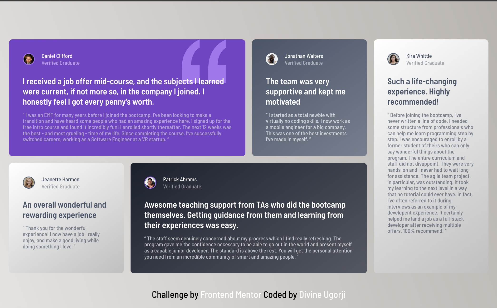

# Frontend Mentor - Testimonials grid section solution

This is a solution to the [Testimonials grid section challenge on Frontend Mentor](https://www.frontendmentor.io/challenges/testimonials-grid-section-Nnw6J7Un7). Frontend Mentor challenges help you improve your coding skills by building realistic projects.

## Table of contents

- [Overview](#overview)

  - [Screenshot](#screenshot)
  - [The challenge](#the-challenge)
  - [Links](#links)

- [My process](#my-process)
  - [Built with](#built-with)
- [Author](#author)
- [Acknowledgments](#acknowledgments)

## Overview

### The challenge

Users should be able to:

- View the optimal layout for the site depending on their device's screen size

### Links

- Solution URL: [Github Link](https://github.com/DivineUgorji/testimonials-grid-section-main)
- Live Site URL: [Live site on Netlify](https://your-live-site-url.com)

## My process

### Built with

- Semantic HTML5 markup
- CSS custom properties
- Flexbox
- CSS Grid
- Mobile-first workflow

## Author

- Frontend Mentor - [DivineUgorji](https://www.frontendmentor.io/profile/DivineUgorji)
- Twitter - [@Divine\_\_Ugorji](https://www.twitter.com/divine__ugorji)

## Acknowledgments
